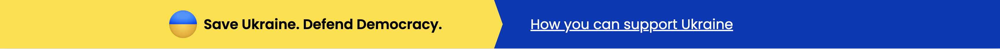

# support-ukraine-bar

## View


## Properties
* Minimal supported width: 320px
* No extra dependencies
* Font is optional


## How to add banner to your website?
1. Copy HTML content between "Start" / "End" comments from **bar.htm** into your HTML file.
2. Copy CSS styles from **bar.css** into your CSS file. *(all classes have "diib" prefix)*
3. Optional: Add Poppins font from Google Fonts
```html
<head>
    <link rel="preconnect" href="https://fonts.gstatic.com" />
    <link
        href="https://fonts.googleapis.com/css2?family=Poppins:wght@400;600&display=swap"
        rel="stylesheet"
</head>
```
4. Test before deployment

## How to make banner sticky?
Add following properties:
```css
.diib-support-ukraine {
    position: sticky;
    top: 0;
}
```

## Support
In case of any questions: **serhii@diib.com**

